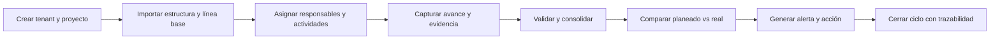
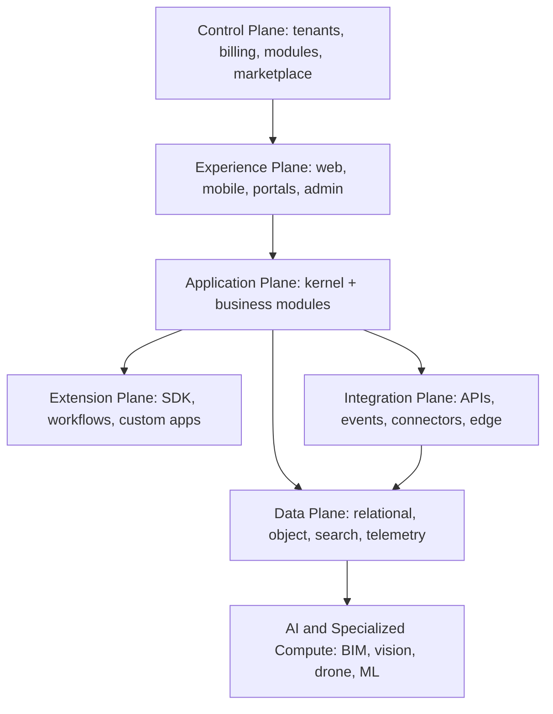

# ARCONT - Documento Maestro de Arranque y PRD

## Control del documento

| Campo | Valor |
| --- | --- |
| Producto | ARCONT |
| Categoría | Composable Construction Intelligence Platform |
| Versión | 0.4 |
| Estado | Borrador para validación con design partners |
| Fecha | 2026-07-11 |
| Horizonte | Preparación, MVP de 90 días y dirección de 12 meses |
| Propietario propuesto | Founder / Product Lead |
| Fuente de verdad | Este documento, una vez aprobado |

## Mapa de lectura

| Bloque | Secciones | Uso principal |
| --- | --- | --- |
| Estrategia | 1 a 6 | Visión, problema, objetivos, mercado y principios |
| Producto | 7 a 12 | Kernel, módulos, extensiones, personas, MVP y dominio |
| Tecnología | 13 a 18 | Arquitectura, internacionalización, integraciones, IA, seguridad y UX |
| Negocio y ejecución | 19 a 23 | Monetización, pilotos, métricas, roadmap y equipo |
| Gobierno | 24 a 31 | Riesgos, gates, decisiones, artefactos, referencias y aprobación |

## 1. Propósito

Definir el punto de partida de ARCONT como producto, plataforma tecnológica y negocio SaaS internacional. Este documento convierte la visión amplia de construcción, ventas, costos, obra, compras, almacenes, recursos humanos, BIM, inteligencia artificial y hardware en una estrategia ejecutable y medible.

ARCONT no se define como un sistema inmobiliario ni como un ERP monolítico. Se define como una plataforma componible para empresas relacionadas con construcción y activos físicos. Cada cliente puede activar uno o varios módulos sin instalar toda la suite.

Este PRD resuelve las decisiones que deben existir antes de desarrollar:

- qué problema se valida primero;
- qué capacidades pertenecen al núcleo obligatorio;
- cómo funcionan los módulos independientes y personalizados;
- qué incluye y qué excluye el primer MVP;
- cómo se escala desde una empresa pequeña hasta un corporativo;
- cómo se internacionaliza el producto;
- cómo se gobiernan BIM, IA, drones, sensores y hardware;
- cómo se monetiza sin convertir la empresa en consultoría a medida;
- qué métricas determinan si se debe continuar, corregir o detener.

## 2. Resumen ejecutivo

### 2.1 Visión

Convertir ARCONT en el sistema operativo componible para planear, vender, construir, controlar y operar proyectos y activos físicos, conectando personas, procesos, modelos, documentos, costos y evidencia real.

### 2.2 Tesis

Las empresas de construcción operan con información fragmentada entre hojas de cálculo, mensajería, sistemas administrativos, archivos BIM/CAD, documentos, plataformas de terceros y registros de campo. La ventaja de ARCONT será unificar esa información mediante un modelo universal, módulos independientes e integraciones abiertas, sin obligar al cliente a reemplazar todo su ecosistema.

### 2.3 Posicionamiento

**Español:**

> ARCONT conecta los datos, procesos y decisiones de la construcción en una plataforma modular que crece con cada empresa.

**Inglés:**

> ARCONT connects construction data, workflows and decisions through a modular platform that grows with every organization.

### 2.4 Decisiones fundamentales

| Decisión | Regla |
| --- | --- |
| Modularidad | Ningún módulo de negocio es obligatorio |
| Núcleo | Solo identidad, tenant, organizaciones, permisos, auditoría, documentos base, configuración, integración y licenciamiento |
| Datos | Cada módulo es propietario de sus datos y publica contratos |
| Personalización | Configuración y extensiones, nunca ramas del producto por cliente |
| Arquitectura inicial | Monolito modular para negocio y servicios independientes para cargas especializadas |
| Primer mercado | México, con arquitectura internacional desde el inicio |
| Primer producto | Un flujo insignia, no toda la suite |
| Cuña recomendada | Project Control Tower, sujeta a validación pagada |
| Campo | Offline-first y tolerante a conectividad intermitente |
| Mobile | Flutter nativo para Android/iOS; Kotlin y Swift detrás de plugins |
| BIM | Autodesk como integración; openBIM como base de interoperabilidad |
| IA | Asistencia gobernada, medible y con aprobación humana en decisiones críticas |
| Escalabilidad | Mismo producto con aislamiento pool, bridge o silo |
| Negocio | Plataforma + módulos + capacidad + consumo + servicios controlados |
| Fiscal | México primero mediante Finance Core, Mexico Fiscal Pack y adapters PAC/SAT |
| Planos operativos | Control Plane de ARCONT separado del Customer Plane de cada tenant |

## 3. Problema y oportunidad

### 3.1 Problemas observados

- Los datos comerciales, técnicos, financieros y de campo no comparten identidad ni trazabilidad.
- La dirección conoce desviaciones cuando ya produjeron costo o retraso.
- Los usuarios de campo duplican captura o reportan por canales no estructurados.
- Los sistemas existentes suelen exigir paquetes completos aunque la empresa necesite un solo proceso.
- Las pequeñas empresas necesitan simplicidad; las grandes necesitan gobierno, integración y aislamiento.
- Las personalizaciones tradicionales crean versiones incompatibles para cada cliente.
- Los modelos Revit y AutoCAD rara vez se convierten en información operacional continua.
- Las imágenes de drones, sensores y dispositivos generan datos sin contexto de proyecto, ubicación o actividad.
- La IA puede producir resultados atractivos pero inseguros si no conserva procedencia, confianza y supervisión.
- La expansión internacional falla cuando impuestos, unidades, idiomas y obligaciones están codificados en el núcleo.

### 3.2 Oportunidad de producto

ARCONT puede competir como capa de coordinación e inteligencia sobre el ecosistema existente. La plataforma no necesita sustituir inmediatamente todos los ERP, CRM o sistemas BIM. Puede entrar por un módulo, demostrar retorno y expandirse hacia procesos adyacentes.

### 3.3 Ventaja fundacional

La experiencia operativa del fundador debe convertirse en activos repetibles:

- modelo común de procesos;
- catálogos y plantillas;
- reglas de control;
- indicadores de riesgo;
- workflows configurables;
- datos comparables entre proyectos;
- conocimiento de implementación.

La experiencia no será defensible si permanece como servicio manual. Debe codificarse en producto, datos y métodos de onboarding.

## 4. Objetivos y no objetivos

### 4.1 Objetivos de los primeros 12 meses

- Validar un flujo insignia con al menos un piloto pagado.
- Alcanzar uso recurrente en proyectos reales, no solamente demostraciones.
- Probar que un cliente puede adquirir y operar un módulo de forma independiente.
- Reducir el tiempo de onboarding mediante importadores, plantillas y configuración.
- Implementar el contrato técnico de módulos y extensiones.
- Publicar una primera API estable y eventos versionados.
- Tener interfaz bilingüe español/inglés y framework de Country Packs.
- Obtener evidencia cuantificable de ahorro, control o reducción de riesgo.
- Preparar controles necesarios para vender a empresas medianas y grandes.
- Validar una primera integración de alto valor sin acoplar el núcleo al proveedor.
- Definir Finance Core y Mexico Fiscal Pack aunque su alcance completo se entregue por fases.

### 4.2 Objetivos del usuario

- Conocer qué requiere atención hoy.
- Capturar información una sola vez y reutilizarla.
- Trabajar desde oficina o campo con la misma identidad del proyecto.
- Configurar procesos sin esperar desarrollo para cada cambio menor.
- Integrar herramientas existentes sin perder propiedad de los datos.
- Recibir recomendaciones explicables y ligadas a evidencia.
- Activar únicamente las capacidades necesarias.

### 4.3 No objetivos del primer año

- Reemplazar todos los sistemas financieros y contables durante el primer MVP; primero se integrará y reconciliará.
- Construir todos los módulos descritos en la visión.
- Abrir un marketplace público antes de estabilizar el SDK.
- Ofrecer dictámenes estructurales automáticos basados en IA.
- Soportar simultáneamente las obligaciones legales de múltiples países.
- Crear infraestructura dedicada para todo cliente pequeño.
- Desarrollar motores CAD, BIM, fotogrametría o modelos fundacionales propios.
- Mantener código o despliegues distintos por cliente.

## 5. Estrategia de mercado

### 5.1 Principio de enfoque

La arquitectura debe servir a empresas pequeñas, medianas y grandes. La estrategia comercial inicial debe enfocarse en un solo perfil y un problema medible. Modularidad de producto no significa dispersión de mercado.

### 5.2 Perfil inicial recomendado

Empresa de construcción o desarrollo con las siguientes características:

- opera más de un frente, etapa o proyecto;
- coordina personal de oficina y campo;
- depende de hojas de cálculo, mensajería y documentos dispersos;
- tiene un patrocinador ejecutivo y un responsable operativo;
- puede proporcionar información real para un piloto;
- reconoce un costo por retrasos, falta de trazabilidad o captura manual;
- acepta un piloto pagado con métricas de éxito.

### 5.3 Segmentos compatibles

| Segmento | Necesidad de entrada posible |
| --- | --- |
| Empresa pequeña | Un módulo, onboarding guiado y operación simple |
| Empresa mediana | Varios proyectos, aprobaciones, costos e integraciones |
| Corporativo | Multiempresa, SSO, auditoría, BI, aislamiento y SLA |
| Desarrolladora | Ventas, inventario, cobranza, entrega y postventa |
| Contratista general | Proyecto, campo, costos, compras y subcontratos |
| Contratista de gobierno | Contratos, estimaciones, cumplimiento y expediente |
| Despacho BIM | Modelos, coordinación, incidencias y entregables |
| Operador de activos | Mantenimiento, tickets, activos, sensores y SLA |

### 5.4 Cuña recomendada

La hipótesis principal es iniciar con `Project Control Tower`, un flujo que une planeación, evidencia de campo y desviaciones. Tiene aplicación en vivienda, obra pública, infraestructura e industria.

La hipótesis no se considera aprobada hasta confirmar disposición de pago. Si el design partner con mejor evidencia necesita `Sales CRM` o `Project Planning` como módulo aislado, el primer módulo puede cambiar sin modificar el kernel ni el contrato de plataforma.

### 5.5 Estrategia de expansión

```text
Problema de entrada
    -> módulo inicial
    -> datos y adopción comprobados
    -> módulo adyacente
    -> integraciones
    -> inteligencia transversal
    -> expansión multiempresa
```

### 5.6 Principios de venta

- Pilotos pagados, con descuento controlado y objetivos explícitos.
- Venta asistida para medianas y grandes empresas.
- Autoservicio progresivo para empresas pequeñas.
- Demostraciones basadas en un flujo y resultado, no en cantidad de pantallas.
- Servicios de implementación productizados y con alcance cerrado.
- Referencias y casos de éxito antes de entrar a múltiples países.

## 6. Principios de producto

| Principio | Implicación |
| --- | --- |
| Composable by default | Cada capacidad puede activarse y licenciarse por separado |
| Configuration before code | Campos, formularios, reglas y workflows deben resolver la mayoría de variaciones |
| One product | No existen forks por cliente, país o vertical |
| Open interoperability | APIs y estándares abiertos evitan dependencia de un proveedor |
| Field reality first | La experiencia debe funcionar con baja conectividad y poco tiempo de captura |
| Traceability by default | Toda decisión crítica conserva actor, fecha, fuente y cambio |
| Progressive complexity | La interfaz revela complejidad según rol, módulo y tamaño del cliente |
| Secure by design | Tenant, permisos, auditoría y cifrado no son complementos posteriores |
| International by architecture | Idioma, moneda, unidades y reglas legales son configuración |
| AI with evidence | Ninguna recomendación crítica existe sin procedencia y control humano |
| Measurable value | Cada módulo debe declarar el resultado económico u operativo esperado |

## 7. Arquitectura funcional de la plataforma

### 7.1 Kernel obligatorio

El kernel es la única dependencia común obligatoria. Debe mantenerse pequeño.

- Tenants y suscripciones.
- Organizaciones, razones sociales y unidades de negocio.
- Usuarios, grupos, identidad y sesiones.
- Roles, permisos y alcances.
- Registro y activación de módulos.
- Entitlements, límites y medición de consumo.
- Auditoría y trazabilidad.
- Archivos y documentos base.
- Configuración, localización y Country Packs.
- Notificaciones base.
- API Gateway, webhooks y bus de eventos.
- Catálogo de integraciones y secretos.
- Observabilidad y soporte.

El kernel no debe contener ventas, presupuestos, viviendas, almacenes ni lógica de obra.

### 7.2 Separación entre Control Plane y Customer Plane

ARCONT debe operar dos dominios con responsabilidades, permisos, APIs y auditorías separadas. Pueden compartir inicialmente repositorio y despliegue dentro del monolito modular, pero no modelo de autorización ni contratos administrativos.

| Dominio | Propietario | Responsabilidades |
| --- | --- | --- |
| ARCONT Control Plane | Operador de la plataforma | Tenants, planes, suscripciones, billing, entitlements, aprovisionamiento, feature flags, soporte, marketplace, cuotas y salud operativa |
| Customer Plane | Cliente | Empresas legales, unidades de negocio, proyectos, usuarios, roles, flujos, catálogos, módulos, integraciones y datos operativos |

Reglas obligatorias:

- crear, suspender, reactivar y terminar tenants únicamente desde el Control Plane;
- aprovisionar tenant, administrador inicial, región, plan, módulos y límites mediante un workflow idempotente y auditable;
- impedir que administradores del cliente obtengan permisos de operador de plataforma;
- permitir soporte con acceso temporal, justificado, aprobado, visible y completamente auditado;
- separar secretos, credenciales y endpoints administrativos de los consumidos por el producto;
- propagar cambios de plan y entitlements mediante contratos, no mediante escritura directa en módulos;
- exportar y eliminar datos conforme a contrato y política de retención al terminar el tenant;
- soportar dominios independientes como `admin.arcont.com` para operación interna y `app.arcont.com` para clientes.

El Control Plane administra el ciclo de vida del servicio. No debe convertirse en el lugar donde ARCONT modifica directamente datos de negocio del cliente.

### 7.3 Catálogo objetivo de módulos

| Dominio | Módulos posibles |
| --- | --- |
| Proyectos | Project Planning, Project Control Tower, Portfolio, Lean Planning |
| Campo | Daily Log, Progress, Evidence, Quality, HSE, Punch List |
| Costos | Budget, Cost Control, Forecast, Change Management |
| Finanzas | Accounts Payable, Accounts Receivable, Treasury, Banking, Cash Flow |
| Contabilidad | Project Accounting, General Ledger, Period Close, Financial Statements |
| Fiscal México | CFDI, PAC Connectors, Payment Complement, Electronic Accounting |
| Abastecimiento | Requisitions, Procurement, Suppliers, Warehouse |
| Contratos | Contracts, Subcontracts, Valuations, Public Works |
| Personas | Workforce, Time and Attendance, Contractors, Training |
| Comercial | Sales CRM, Product Catalog, Quotes, Reservations |
| Inmobiliario | Unit Inventory, Closing, Mortgage, Gestoría, Post-sales |
| Documental | CDE, RFIs, Submittals, Transmittals, Compliance |
| BIM y diseño | BIM Hub, Model Coordination, Revit/AutoCAD Connectors |
| Activos | Asset Registry, Commissioning, Maintenance, Work Orders |
| Inteligencia | Reporting, Executive Control, AI Copilot, Forecasting |
| Conectividad | IoT, Drones, Telemetry, Access Control, Device Management |

Esta tabla representa dirección de producto, no compromiso de construir todos los módulos durante el primer año.

### 7.4 Independencia de módulos

Todo módulo debe cumplir estas condiciones:

- puede instalarse sin módulos de negocio no declarados;
- declara capacidades requeridas, no dependencias implícitas;
- es dueño de sus tablas, migraciones y políticas de retención;
- consume información de otros módulos mediante API o eventos;
- puede operar con una referencia mínima cuando el módulo relacionado no existe;
- registra permisos, navegación, jobs, consumo y telemetría;
- puede desactivarse sin corromper los datos de otros módulos;
- expone exportación de datos y política de compatibilidad.

### 7.5 Solution Packs

Los paquetes verticales son configuraciones, no productos separados.

| Solution Pack | Composición ilustrativa |
| --- | --- |
| Residential Sales | Sales CRM + Unit Inventory + Closing + Post-sales |
| General Contractor | Project Control + Field + Cost + Procurement + Quality |
| Public Works | Contracts + Valuations + Field + Cost + Compliance |
| BIM Coordination | BIM Hub + Documents + RFIs + Issues |
| Asset Operations | Assets + Maintenance + IoT + Service Desk |
| Small Business Projects | Project Planning + Daily Log + Documents |
| Mexico Finance | Project Accounting + AP/AR + Treasury + Mexico Fiscal Pack |
| Mexico Construction Compliance | Contracts + Workforce + SIROC/REPSE evidence + Audit |

## 8. Plataforma de extensiones

### 8.1 Objetivo

Permitir que ARCONT, partners y clientes creen módulos a medida sin modificar el núcleo ni bloquear actualizaciones.

### 8.2 Niveles de personalización

| Nivel | Herramientas | Ejemplo |
| --- | --- | --- |
| Configuración | Campos, catálogos, vistas, permisos, plantillas | Campo de contrato o reporte particular |
| Automatización | Reglas, workflows, aprobaciones, alertas | Aprobación por monto y tipo de obra |
| Integración | API, webhook, importador, conector | Sincronización con ERP o reloj checador |
| Módulo custom | UI, backend, datos y jobs propios | Estimaciones especiales para un organismo |

### 8.3 Contrato mínimo de un módulo

```yaml
id: arcont.module-id
version: 1.0.0
platformCompatibility: ">=1.0 <2.0"
capabilitiesProvided: []
capabilitiesRequired: []
permissions: []
navigation: []
uiExtensions: []
eventsPublished: []
eventsConsumed: []
apiRoutes: []
jobs: []
migrations: []
meters: []
dataClassification: internal
uninstallPolicy: retain-data
```

### 8.4 Puntos de extensión

- Navegación y búsqueda global.
- Página de inicio por rol.
- Acciones contextuales.
- Pestañas y paneles en entidades públicas.
- Formularios declarativos.
- Workflows y reglas.
- Dashboards y reportes.
- Jobs asíncronos.
- Webhooks y suscripciones a eventos.
- Conectores de datos y dispositivos.
- Comandos del asistente de IA.

### 8.5 Reglas de seguridad para extensiones

- Sin acceso directo a tablas de otro módulo.
- Identidad y contexto de tenant emitidos por la plataforma.
- Secretos almacenados fuera del código.
- Permisos y scopes explícitos.
- Límites de CPU, memoria, almacenamiento y eventos.
- Egress de red restringido por política.
- Paquetes firmados y escaneo de dependencias.
- Logs y métricas integrados a observabilidad.
- Instalación y rollback auditables.
- Certificación antes de publicar en marketplace.

### 8.6 Política anti-forks

No se crea una rama por cliente. Toda necesidad debe clasificarse como:

1. configuración reutilizable;
2. capacidad genérica del producto;
3. módulo custom sobre el SDK;
4. integración externa.

### 8.7 Evolución del ecosistema

| Etapa | Resultado |
| --- | --- |
| Etapa 1 | SDK interno para módulos oficiales |
| Etapa 2 | SDK privado para proyectos custom certificados |
| Etapa 3 | Programa de partners y sandbox de desarrollo |
| Etapa 4 | Marketplace curado |
| Etapa 5 | Marketplace público con reputación, billing y revenue share |

## 9. Personas y trabajos principales

### 9.1 Comprador ejecutivo

Necesita control, retorno, gobierno, comparación entre proyectos y reducción de riesgo. Aprueba presupuesto y expansión.

### 9.2 Director o gerente de proyecto

Necesita integrar programa, responsables, avances, restricciones, costos y decisiones. Es propietario operativo del piloto recomendado.

### 9.3 Residente, supervisor o usuario de campo

Necesita capturar rápido, trabajar offline, ver pendientes y adjuntar evidencia sin navegar procesos administrativos complejos.

### 9.4 Costos, compras y administración

Necesita trazabilidad entre presupuesto, requisición, compromiso, recepción, factura y costo real.

### 9.5 Contabilidad, tesorería y fiscal

Necesita controlar cuentas por pagar y cobrar, bancos, flujo, cierres, pólizas, CFDI y obligaciones mexicanas con trazabilidad por empresa, proyecto y centro de costo.

### 9.6 Comercial y ventas

Necesita pipeline, catálogo, disponibilidad, cotización, reserva y seguimiento, sin requerir módulos de construcción.

### 9.7 BIM, diseño y coordinación

Necesita versionar modelos, validar información, asociar incidencias y conectar elementos técnicos con procesos.

### 9.8 TI, seguridad y administrador de tenant

Necesita usuarios, SSO, permisos, auditoría, integraciones, módulos, consumo, políticas y soporte.

### 9.9 Contratista, proveedor o cliente externo

Necesita acceso restringido a sus propias tareas, documentos, órdenes, entregables o incidencias.

## 10. Selección del MVP

### 10.1 Hipótesis recomendada

Un equipo de proyecto pagará por detectar y atender desviaciones antes si ARCONT conecta planeación, captura de campo, evidencia y una vista ejecutiva en un solo flujo.

### 10.2 Gate de selección

El módulo inicial se confirma cuando exista:

- un patrocinador con autoridad;
- un problema frecuente y económicamente relevante;
- datos disponibles;
- usuarios operativos comprometidos;
- una métrica base;
- disposición de pago;
- un flujo que pueda probarse en 90 días.

Si estas condiciones no se cumplen para Project Control Tower, se evalúa el módulo con mejor evidencia. La decisión debe cambiar alcance, no plataforma.

## 11. MVP recomendado: Project Control Tower

### 11.1 Resultado esperado

Permitir que una empresa configure un proyecto, importe una línea base, capture avance con evidencia y detecte desviaciones desde una vista ejecutiva.

### 11.2 Flujo principal



### 11.3 Alcance funcional

#### Plataforma

- Alta de tenant, empresa y proyecto.
- Usuarios, roles y scopes por proyecto.
- Activación del módulo contratado.
- Auditoría de acciones críticas.
- Archivos, comentarios y notificaciones base.
- Configuración regional inicial para México.

#### Proyecto

- Estructura flexible de trabajo y ubicaciones.
- Catálogo de actividades y responsables.
- Importación CSV/XLSX con validación y vista previa.
- Línea base simple de fechas, cantidades y avance esperado.
- Estados y prioridades configurables.

#### Campo

- Lista de actividades asignadas.
- Captura de cantidad o porcentaje de avance.
- Fotografías, notas, fecha, autor y ubicación.
- Borrador offline y sincronización posterior.
- Incidencias y bloqueos vinculados a actividad y ubicación.

#### Control

- Planeado contra reportado y validado.
- Actividades retrasadas o sin evidencia.
- Alertas por umbral configurable.
- Responsable, fecha objetivo y estado de atención.
- Resumen por proyecto, frente, responsable y periodo.

#### Datos y salida

- Exportación CSV/XLSX.
- API de lectura para proyecto, actividad y avance.
- Eventos de actividad creada, avance reportado, avance validado y desviación detectada.
- Dashboard con trazabilidad hacia la evidencia original.

### 11.4 Requerimientos y criterios de aceptación

| ID | Requerimiento | Criterio de aceptación |
| --- | --- | --- |
| CORE-01 | Crear tenant y organización | Los datos quedan aislados y auditados por tenant |
| CORE-02 | Activar módulos | Navegación, permisos y límites cambian sin redeploy |
| IAM-01 | Asignar roles por proyecto | Un usuario no accede a proyectos fuera de su scope |
| PRJ-01 | Crear estructura flexible | El proyecto no exige torre, piso, vivienda ni activo |
| IMP-01 | Importar línea base | El usuario revisa errores antes de confirmar y puede revertir la importación |
| FLD-01 | Capturar avance | La captura conserva actividad, cantidad, autor y fecha |
| FLD-02 | Operar offline | El usuario guarda borradores y sincroniza al recuperar conexión |
| EVD-01 | Adjuntar evidencia | La evidencia conserva metadatos, permisos y vínculo al registro |
| CTL-01 | Comparar planeado vs real | La desviación puede rastrearse hasta datos y evidencia origen |
| ALT-01 | Crear alerta | El umbral es configurable y la alerta tiene responsable y estado |
| AUD-01 | Auditar cambios | Cambios críticos conservan antes, después, actor y fecha |
| EXP-01 | Exportar datos | El tenant puede descargar su información en formato documentado |
| API-01 | Consumir API | La API aplica autenticación, scope, paginación y versionado |
| OBS-01 | Medir uso | Se registran activación, captura, sincronización, error y cierre del ciclo |

### 11.5 Fuera del MVP

- Contabilidad completa.
- Nómina.
- Compras y almacén productivos.
- CRM y venta inmobiliaria.
- Visualizador BIM avanzado.
- Procesamiento de drones.
- Sensores en producción.
- Forecasting con ML.
- Detección estructural.
- Marketplace.
- Múltiples Country Packs productivos.
- Workflows no-code de propósito general.

## 12. Modelo de dominio universal

### 12.1 Estructura organizacional

```text
Tenant
  -> Legal Entity
  -> Business Unit
  -> Portfolio
  -> Project or Asset
```

La relación debe admitir organizaciones pequeñas con una sola empresa y corporativos con múltiples razones sociales.

Definiciones canónicas:

- `Tenant`: contrato, frontera de seguridad, configuración global y aislamiento de datos de un cliente;
- `Legal Entity`: razón social con identidad jurídica, fiscal y contable propia;
- `Business Unit`: división, sucursal, región o unidad operativa sin asumir personalidad jurídica;
- `Project or Asset`: contexto operativo donde se ejecutan procesos y se imputan costos, documentos y evidencia.

Un tenant puede contener múltiples empresas legales y países. Una empresa legal puede contener múltiples unidades de negocio y proyectos. Ninguna de estas entidades debe utilizarse como sinónimo de otra.

### 12.2 Estructuras paralelas del proyecto

| Estructura | Propósito |
| --- | --- |
| WBS | Descomposición del trabajo |
| CBS | Descomposición de costos |
| OBS | Responsabilidad organizacional |
| Location Breakdown | Sitios, zonas, niveles, tramos o unidades configurables |
| Asset Breakdown | Sistemas, equipos y componentes físicos |
| Contract Breakdown | Contratos, partidas, entregables y obligaciones |

Una vivienda, carretera, nave industrial o instalación pública debe representarse sin cambiar el núcleo.

### 12.3 Entidades públicas del kernel

- Tenant.
- Organization.
- User y Group.
- Role y Scope.
- Module Installation.
- Entitlement y Meter.
- File y Document Reference.
- Audit Event.
- Integration Connection.
- Locale y Country Pack.

### 12.3.1 Configuración inicial del cliente

El Customer Plane debe ofrecer un asistente de configuración con estado reanudable para:

1. crear la organización y sus empresas legales;
2. configurar RFC, régimen, domicilio, moneda funcional, zona horaria e idioma;
3. crear unidades de negocio, sucursales, almacenes, centros de costo y proyectos;
4. seleccionar módulos, Solution Packs y plantillas;
5. definir administradores, grupos, roles y alcances;
6. importar catálogos y datos iniciales;
7. conectar integraciones y verificar credenciales;
8. ejecutar controles de preparación antes de operar.

Cada paso debe validar dependencias, conservar auditoría y poder repetirse de forma segura sin duplicar información.

### 12.4 Propiedad de datos

| Dato | Propietario |
| --- | --- |
| Lead y oportunidad | Sales CRM |
| Actividad y línea base | Project Planning o Project Control |
| Avance y evidencia | Field |
| Presupuesto y costo | Cost Control |
| Requisición y orden | Procurement |
| Elemento y versión BIM | BIM Hub |
| Dispositivo y telemetría | IoT |
| Usuario y scope | Kernel IAM |

Otros módulos pueden referenciar el identificador público, pero no escribir directamente en su almacenamiento.

### 12.5 Modelo de eventos

Todo evento debe incluir:

- `eventId` único;
- `eventType` y versión;
- `occurredAt`;
- `tenantId`;
- actor y origen;
- entidad y versión;
- correlation y causation IDs;
- payload mínimo y clasificación;
- política de retención.

Los consumidores deben ser idempotentes. Los eventos publicados no se modifican; se versionan.

### 12.6 Modelo financiero y fiscal

Las entidades financieras no deben depender de ventas, vivienda o compras para existir.

| Entidad | Responsabilidad |
| --- | --- |
| Fiscal Entity | RFC, razón social, régimen, domicilio y configuración fiscal |
| Accounting Book | Libro, moneda funcional, ejercicio y políticas |
| Accounting Period | Apertura, cierre, bloqueo y reapertura auditada |
| Chart of Account | Cuenta interna y código agrupador aplicable |
| Journal Entry | Póliza balanceada y fuente operacional |
| Journal Line | Cargo, abono, moneda y dimensiones |
| Subledger Document | Factura, estimación, anticipo, retención o pago |
| Tax Document | CFDI original, UUID, versión, estatus y relaciones |
| Receivable/Payable | Saldo, vencimiento, parcialidades y aplicación |
| Bank Transaction | Movimiento bancario importado o integrado |
| Reconciliation | Relación banco, pago, CFDI y póliza |
| Tax Rule | Regla versionada por vigencia y jurisdicción |

Toda línea financiera debe admitir dimensiones de empresa, proyecto, WBS, CBS, contrato, proveedor, cliente y centro de costo sin obligar a que todos esos módulos estén instalados.

## 13. Arquitectura técnica objetivo

### 13.1 Macroarquitectura



### 13.2 Estrategia de servicios

Comenzar con un monolito modular para el kernel y módulos de negocio. Separar desde el inicio únicamente cargas con características operativas distintas:

- procesamiento BIM/CAD;
- imágenes, video y drones;
- inferencia y entrenamiento de IA;
- telemetría IoT;
- integraciones de larga duración;
- notificaciones masivas.

Un módulo no se convierte en microservicio por organización del código. Se separa cuando existen necesidades demostradas de escala, aislamiento, equipo o disponibilidad.

### 13.3 Stack inicial recomendado

| Capa | Decisión inicial |
| --- | --- |
| Web | Next.js y TypeScript |
| Mobile | Flutter nativo para Android/iOS, con plugins Kotlin/Swift para capacidades específicas |
| Backend | TypeScript con arquitectura modular explícita |
| Procesamiento especializado | Python y workers aislados cuando aplique |
| Base operacional | PostgreSQL con PostGIS |
| Archivos | Object storage compatible con S3 |
| Cache y jobs cortos | Redis |
| Mensajería inicial | Broker administrado o cola con soporte de reintentos |
| Búsqueda | PostgreSQL primero; OpenSearch cuando el volumen lo justifique |
| Telemetría | Extensión time-series o servicio especializado cuando exista caso real |
| Observabilidad | OpenTelemetry, métricas, logs y trazas correlacionadas |
| Infraestructura | Contenedores y servicios administrados; IaC obligatorio |

### 13.4 Patrones obligatorios

- Transactional outbox para eventos de negocio.
- Idempotency keys para comandos externos.
- API versionada y documentada.
- Migraciones forward-only con rollback operativo.
- Feature flags separados de entitlements comerciales.
- Contexto de tenant validado en cada request y job.
- Tareas pesadas asíncronas con estado consultable.
- Límites, cuotas y backpressure.
- Correlation IDs de extremo a extremo.
- Contratos de datos probados automáticamente.

### 13.4.1 Superficies de API

| Superficie | Consumidores | Regla de acceso |
| --- | --- | --- |
| Control API | Operación interna y automatización de ARCONT | Privada, credenciales privilegiadas, red restringida y auditoría reforzada |
| Product API | Web, Flutter y portales del cliente | Contexto de tenant obligatorio, scopes funcionales e idempotencia |
| Integration API | ERP, BIM, PAC, dispositivos y socios | OAuth clients, cuotas, webhooks firmados y contratos versionados |
| Extension API | Módulos custom y marketplace | Capacidades explícitas, sandbox, límites y revisión de seguridad |

Ningún token emitido para Product, Integration o Extension API puede invocar la Control API. Los esquemas pueden compartir identificadores públicos, pero los comandos administrativos y operativos deben permanecer separados.

### 13.5 Aislamiento por nivel de servicio

| Perfil | Modelo |
| --- | --- |
| Starter | Pool con aislamiento lógico y recursos compartidos |
| Growth | Bridge con recursos o base separados según necesidad |
| Enterprise | Silo para datos o stack dedicado cuando el contrato lo requiera |

Todos los perfiles utilizan el mismo código, control plane, proceso de actualización y experiencia operativa.

### 13.6 Edge y conectividad de obra

Para sensores, relojes, drones y sitios con internet intermitente se requiere un edge gateway opcional:

- store-and-forward;
- cache local cifrado;
- sincronización firmada;
- identidad de dispositivo;
- reintentos y deduplicación;
- actualización remota;
- diagnóstico de conectividad.

Starlink, fibra, LTE o radio son transportes de red. ARCONT no debe depender de uno de ellos.

## 14. Internacionalización y Country Packs

### 14.1 Internacionalización base

- Cadenas externas localizables, sin texto de negocio hardcoded.
- Fechas, zonas horarias y calendarios por usuario y proyecto.
- Monedas y precisión decimal por documento.
- Sistemas métrico e imperial.
- Números y unidades con formato regional.
- Direcciones y subdivisiones configurables.
- Plantillas documentales por idioma.
- Glosario de términos por país y vertical.
- APIs y nombres técnicos estables en inglés.
- Etiquetas de interfaz traducibles sin cambiar contratos.

### 14.2 Contenido de un Country Pack

- Locale y formatos.
- Monedas e impuestos soportados.
- Unidades y convenciones técnicas.
- Catálogos regulatorios.
- Documentos y cláusulas parametrizadas.
- Retención y privacidad.
- Adaptadores de facturación o firma.
- Reportes requeridos.
- Terminología local.
- Revisión y versión legal.

### 14.3 Secuencia geográfica

1. México es el único mercado operativo durante la etapa inicial.
2. Primero se estabilizan producto, soporte, Finance Core y Mexico Fiscal Pack.
3. Un segundo país solo se abre después de product-market fit y clientes recurrentes en México.
4. El siguiente país se selecciona por design partner pagado y costo regulatorio, no solo por tamaño de mercado.
5. La arquitectura, APIs y documentación técnica permanecen internacionalizables desde el inicio.
6. Europa requiere preparación adicional de privacidad, accesibilidad y gobierno de IA.

### 14.4 Estándares de interoperabilidad objetivo

- IFC, BCF, IDS y openCDE para openBIM.
- Autodesk Platform Services para workflows Revit y AutoCAD.
- OpenAPI para APIs síncronas.
- Eventos con esquemas versionados y documentación equivalente a AsyncAPI.
- MQTT para telemetría compatible.
- GeoTIFF y formatos geoespaciales abiertos para ortomosaicos.
- Formatos de nube de puntos documentados y preservación del CRS.
- OIDC, SAML y SCIM para identidad enterprise.
- WCAG 2.2 AA para accesibilidad.
- Unicode CLDR para localización.

### 14.5 Finance & Accounting Architecture

El dominio financiero se entrega en tres capas independientes:

| Capa | Alcance |
| --- | --- |
| Finance Operations | AP, AR, cobranza, pagos, tesorería, bancos, flujo y conciliación |
| Project Accounting | Presupuesto, comprometido, devengado, pagado, estimaciones, anticipos, amortizaciones y retenciones |
| Accounting Core | Catálogo, pólizas, periodos, balanza, auxiliares, estados financieros y consolidación |

La primera estrategia es integración y subledger. Accounting Core nativo se construye únicamente cuando exista demanda pagada y revisión contable profesional.

### 14.6 Mexico Fiscal Pack

Capacidades objetivo:

- Configuración de RFC, razón social, régimen y domicilio fiscal.
- Recepción, emisión, validación, cancelación y relación de CFDI.
- Conservación inmutable del XML, representación, UUID, hash y estatus.
- CFDI 4.0 mediante adapters a Proveedores Autorizados de Certificación.
- Complemento para recepción de pagos 2.0.
- Complemento de nómina cuando se active Payroll.
- Carta Porte cuando aplique transporte de bienes o materiales.
- Catálogos SAT versionados por vigencia.
- Impuestos y retenciones parametrizados con revisión profesional.
- Catálogo de cuentas y asociación al código agrupador SAT.
- Balanza, pólizas y auxiliares para contabilidad electrónica.
- Cierres, reaperturas y correcciones auditadas.
- Descarga, conciliación y exportación hacia sistemas contables externos.

ARCONT no operará como PAC. El timbrado se realizará mediante adapters reemplazables a proveedores autorizados. Certificados, sellos y secretos fiscales deben permanecer en vault o infraestructura especializada, nunca en tablas, logs o código.

### 14.7 Mexico Construction Compliance Pack

Este paquete es distinto del SAT y se activa según tipo de empresa y obra:

- expediente de registro de obra e incidencias SIROC;
- registros patronales y responsables;
- evidencia de REPSE cuando aplique;
- contratistas y subcontratistas vinculados a obra;
- documentos IMSS/INFONAVIT relacionados;
- calendario, alertas, acuses y auditoría;
- exportación de evidencia para revisión profesional.

El sistema administra datos, evidencia y workflows; no sustituye la interpretación de un contador, fiscalista o especialista laboral.

## 15. Estrategia de integraciones

### 15.1 Niveles

| Nivel | Capacidad |
| --- | --- |
| 0 | Importación y exportación manual validada |
| 1 | API y webhooks |
| 2 | Conector administrado y sincronización |
| 3 | Automatización bidireccional con reconciliación |
| 4 | Edge o streaming en tiempo real |

### 15.2 Prioridad inicial

1. CSV/XLSX y plantillas de migración.
2. API pública y webhooks.
3. Almacenamiento documental y correo.
4. Una integración de planeación o ERP elegida por el piloto.
5. Autodesk/ACC cuando exista flujo BIM validado.
6. Relojes, sensores o drones cuando exista propietario operacional y métrica.

### 15.3 Prioridad financiera México

1. Importar y validar CFDI recibidos.
2. Relacionar CFDI con empresa, proveedor, proyecto, contrato y costo.
3. Controlar cuentas por pagar/cobrar y flujo básico.
4. Exportar pólizas o movimientos al sistema contable existente.
5. Integrar un PAC para emisión y cancelación.
6. Incorporar complemento de pagos y conciliación bancaria.
7. Generar contabilidad electrónica cuando Accounting Core esté validado.

### 15.4 Revit y AutoCAD

- No almacenar la lógica de negocio dentro de plugins de escritorio.
- Utilizar plugins para extracción, publicación o comandos contextuales.
- Ejecutar automatizaciones masivas mediante servicios cloud cuando sea viable.
- Normalizar entidades hacia IDs ARCONT y estándares abiertos.
- Conservar archivo original, versión, transformación y procedencia.
- Permitir que el cliente exporte su información sin Autodesk.

### 15.5 Drones y realidad capturada

Pipeline objetivo:

```text
Misión y metadatos
  -> carga de imágenes o productos procesados
  -> validación de CRS y precisión
  -> ortomosaico / nube de puntos / malla
  -> alineación con proyecto o BIM
  -> comparación temporal
  -> hallazgo con evidencia
  -> revisión humana
```

El MVP no incluye construir un motor propio de fotogrametría.

### 15.6 Dispositivos y relojes

- Adaptadores por fabricante.
- Modelo canónico de dispositivo, persona, evento y ubicación.
- Sincronización tolerante a duplicados y relojes desfasados.
- Consentimiento y reglas de privacidad para datos laborales.
- Alertas por salud del dispositivo y atraso de sincronización.

## 16. Plataforma de IA y gobierno

### 16.1 Principio

La IA es una capacidad transversal, no un módulo que evita diseñar procesos. El producto debe funcionar sin IA y mejorar cuando existen datos suficientes.

### 16.2 Clasificación de casos de uso

| Riesgo | Ejemplos | Control mínimo |
| --- | --- | --- |
| Bajo | Búsqueda, resumen, traducción, extracción | Fuente, feedback y límites de acceso |
| Medio | Clasificación, priorización, forecast, anomalías | Evaluación, confianza, revisión y monitoreo |
| Alto | Seguridad, estructura, pagos, contratos, empleo | Especialista responsable, evidencia, aprobación y bloqueo automático de acción |

### 16.3 Componentes de AI Control Plane

- Gateway multi-proveedor.
- Registro de modelos y versiones.
- Registro de prompts y herramientas.
- Dataset y lineage.
- Suite de evaluaciones por caso de uso.
- Políticas de acceso y redacción de datos.
- Presupuesto, cuotas y medición de consumo.
- Logs de entrada, salida, fuente y decisión.
- Human-in-the-loop.
- Gestión de incidentes y rollback.

### 16.4 Datos del cliente

- No entrenar modelos compartidos con datos del tenant sin consentimiento explícito.
- Separar almacenamiento, índices y contexto por tenant.
- Permitir retención configurable.
- Documentar subprocesadores y proveedores.
- Ofrecer opt-out y borrado cuando aplique.
- Mantener exportación de resultados y evidencia.

### 16.5 Detección de fallas estructurales

Debe tratarse como soporte a inspección, no como dictamen.

- Definir tipo de defecto y condiciones de captura.
- Utilizar datasets autorizados y etiquetado profesional.
- Registrar dispositivo, calibración, ubicación y calidad de imagen.
- Separar detección visual, reglas ingenieriles y decisión profesional.
- Mostrar confianza y causas de rechazo.
- Exigir aprobación de especialista antes de cerrar o liberar.
- Medir falsos positivos y falsos negativos por tipo de falla.
- Suspender el modelo ante drift o desempeño insuficiente.

### 16.6 IA en el primer MVP

La IA no es requisito para validar Project Control Tower. Puede agregarse una función de bajo riesgo, como resumen de incidencias con enlaces a fuentes, únicamente si no retrasa el flujo principal.

## 17. Seguridad, privacidad y confiabilidad

### 17.1 Controles mínimos de producción

- MFA para roles privilegiados.
- OIDC y preparación para SAML/SCIM.
- RBAC con scopes y evolución hacia ABAC.
- Separación de funciones en acciones financieras, legales y administrativas.
- Cifrado en tránsito y reposo.
- URLs firmadas y expirables para archivos.
- Secret manager y rotación.
- Auditoría inmutable para eventos críticos.
- Backups probados mediante restauración.
- Gestión de vulnerabilidades y dependencias.
- SAST, DAST y escaneo de infraestructura.
- Rate limiting y protección de abuso.
- Inventario de activos y subprocesadores.
- Proceso de incidentes y notificación.
- Vault y rotación para CSD, tokens PAC y secretos fiscales.
- Inmutabilidad y hash para XML fiscales originales.
- Segregación entre alta de proveedor, aprobación, pago, póliza y cierre.

### 17.2 Baselines

- OWASP ASVS 5.0 para requisitos verificables de aplicación.
- Threat modeling para módulos e integraciones críticas.
- WCAG 2.2 AA para experiencia web.
- Privacy by design para usuarios, trabajadores, clientes y dispositivos.
- Ruta a ISO 27001 y SOC 2 según exigencia comercial.

### 17.3 Objetivos iniciales de servicio

| Indicador | Objetivo preliminar |
| --- | --- |
| Disponibilidad de producción | 99.5% durante piloto; 99.9% como oferta enterprise futura |
| RPO | 1 hora para datos operacionales críticos |
| RTO | 4 horas para servicio principal |
| Respuesta API estándar | p95 menor a 500 ms, excluyendo procesos pesados |
| Carga de pantalla operativa | p75 menor a 2.5 s en condiciones objetivo |
| Procesos pesados | Asíncronos, reintentables y con progreso visible |
| Sincronización offline | Sin pérdida silenciosa; conflictos visibles y resolubles |

Los objetivos deben revisarse después de medir el piloto y antes de convertirlos en SLA contractual.

### 17.4 Paquete de confianza enterprise

- Diagrama de arquitectura y flujo de datos.
- DPA y términos de procesamiento.
- Lista de subprocesadores.
- Política de backups y continuidad.
- Resumen de pruebas de penetración.
- Matriz de controles.
- Página de estado.
- Política de exportación y terminación.
- SLA y canales de soporte.

## 18. Experiencia de producto

### 18.1 Superficies

- Web corporativa para configuración, análisis y operación de oficina.
- Aplicación de campo offline-first.
- Portales externos simplificados.
- Consola de plataforma para tenants, módulos, billing y soporte.
- Developer Portal para documentación, credenciales, eventos y sandbox.

La consola de plataforma y la aplicación del cliente deben tener navegación, sesiones privilegiadas y despliegues lógicamente independientes. La primera optimiza operación SaaS; la segunda, trabajo del cliente.

### 18.2 Principios UX

- Navegación generada por módulos activos y permisos.
- Contexto visible de empresa, proyecto, ubicación y periodo.
- Home diferente por rol, con modelo mental común.
- Acciones rápidas y captura con poco texto.
- Evidencia y fuente visibles detrás de indicadores.
- Estados vacíos que guían onboarding.
- Diseño accesible y usable con guantes, sol y pantallas móviles cuando aplique.
- Lenguaje localizable y glosario por vertical.
- Sin inconsistencias visuales entre módulos oficiales y custom.

### 18.3 Onboarding

El producto debe guiar este recorrido:

```text
Crear cuenta
  -> seleccionar módulo o Solution Pack
  -> configurar organización y proyecto
  -> importar datos
  -> invitar equipo
  -> completar primer ciclo de valor
  -> medir resultado
```

La activación no se considera completa al iniciar sesión. Se considera completa cuando el cliente termina el primer ciclo de valor del módulo.

### 18.4 Flutter Field App

La aplicación de campo será Flutter para Android e iOS. Flutter Web no sustituye la aplicación corporativa Next.js.

```text
field_mobile/
  core/
    auth/
    database/
    networking/
    sync/
    files/
    security/
  modules/
    projects/
    progress/
    evidence/
    issues/
  platform/
    camera/
    location/
    notifications/
    bluetooth/
    nfc/
```

Arquitectura offline obligatoria:

- SQLite como fuente local para datos sincronizados.
- Outbox local para comandos pendientes.
- Identificadores generados antes de recuperar conexión.
- API idempotente y versionada.
- Sincronización incremental por cursor.
- Cola independiente para fotografías y archivos.
- Compresión, checksum y reanudación de carga.
- Conflictos visibles; nunca sobrescritura silenciosa.
- Secure storage para tokens y claves locales.
- Cifrado de datos sensibles en dispositivo.
- Clientes Dart generados desde OpenAPI.
- Plugins Kotlin/Swift para capacidades no cubiertas por Flutter.
- Telemetría de sync, almacenamiento, batería, red y fallos.

El spike se considera aprobado cuando puede operar sin red, capturar al menos 30 evidencias, cerrar y reabrir la app, recuperar conexión, reintentar cargas y reconciliar conflictos sin pérdida silenciosa.

## 19. Modelo de negocio

### 19.1 Fórmula comercial

```text
Ingreso recurrente =
plataforma base
+ módulos activos
+ capacidad contratada
+ consumo tecnológico
+ nivel de soporte
```

### 19.2 Ejes independientes

El nivel de servicio y los módulos se venden por separado. Una empresa grande puede comprar un solo módulo con aislamiento dedicado. Una empresa pequeña puede combinar dos módulos en infraestructura compartida.

| Nivel | Servicio |
| --- | --- |
| Starter | Pool, onboarding guiado, soporte estándar |
| Growth | Más capacidad, API, workflows, integraciones y soporte prioritario |
| Enterprise | SSO, auditoría avanzada, SLA, aislamiento y gobierno |

### 19.3 Unidades de precio posibles

- Tenant o empresa.
- Proyecto activo.
- Módulo activo.
- Usuario profesional.
- Capacidad de almacenamiento.
- Dispositivo conectado.
- Procesamiento BIM o drone.
- Inferencia o créditos de IA.
- Ejecuciones de automatización.

No se recomienda cobrar de forma prohibitiva por cada usuario de campo, contratista o colaborador externo. El precio debe favorecer la captura completa y el efecto de red dentro del proyecto.

### 19.4 Ingresos complementarios

- Implementación productizada.
- Migración y limpieza de datos.
- Desarrollo de conectores.
- Desarrollo de módulos custom.
- Mantenimiento de módulos exclusivos.
- Soporte premium.
- Capacitación y certificación.
- Servicios administrados de hardware.
- Revenue share del marketplace.

### 19.5 Modalidades de customización

| Modalidad | Regla comercial |
| --- | --- |
| Configuración | Fee de implementación con alcance cerrado |
| Módulo reutilizable | Cliente cofinancia; ARCONT conserva derecho de producto acordado |
| Módulo exclusivo | Cliente paga desarrollo, aislamiento y mantenimiento |
| Aplicación de partner | Partner desarrolla y vende; ARCONT certifica y recibe comisión |

Los derechos de propiedad intelectual, uso de datos y mantenimiento deben quedar en contrato antes de desarrollar.

### 19.6 Guardrails financieros

- Medir costo cloud por tenant, proyecto, módulo y tipo de consumo.
- Separar margen de software y margen de servicios.
- Limitar descuentos y pilotos gratuitos.
- No comprometer SLA enterprise con infraestructura Starter.
- No incluir consumo ilimitado de IA, BIM o video sin límites.
- Medir horas de implementación por cliente.
- Rechazar customizaciones que creen dependencia de conocimiento no repetible.

## 20. Programa de design partners y piloto

### 20.1 Requisitos del design partner

- Problema alineado con la hipótesis.
- Sponsor ejecutivo.
- Product owner operativo.
- Usuarios disponibles para pruebas.
- Datos reales y autorizados.
- Disposición de pago.
- Acuerdo sobre uso, privacidad y exportación.
- Acceso a métricas antes y después.
- Cadencia semanal de seguimiento.

### 20.2 Estructura del piloto

| Fase | Duración sugerida | Resultado |
| --- | --- | --- |
| Discovery | 2 semanas | Proceso, baseline, datos y alcance |
| Configuración y preparación | 2 a 4 semanas | Tenant, importación, usuarios y capacitación |
| Operación controlada | 6 a 8 semanas | Uso real y ciclos completos |
| Evaluación | 1 semana | ROI, adopción, fallas y decisión de expansión |

### 20.3 Responsabilidades del cliente

- Nombrar sponsor y owner.
- Entregar datos en fecha.
- Proporcionar usuarios y tiempo de entrenamiento.
- Operar el proceso acordado en ARCONT.
- Reportar incidentes y feedback.
- Validar métricas y resultados.

### 20.4 Criterios de éxito del piloto

Los valores exactos se establecen con el baseline. Como mínimo se debe demostrar:

- ciclos de control completados semanalmente;
- adopción recurrente del grupo operativo;
- trazabilidad de datos y evidencia;
- detección o atención más temprana de desviaciones;
- reducción de captura duplicada o consolidación manual;
- disposición del cliente a renovar o ampliar.

### 20.5 Criterios de salida o pausa

- No existe sponsor o owner activo.
- Los datos no están disponibles o no pueden utilizarse legalmente.
- El problema no tiene valor económico identificable.
- Los usuarios no completan el flujo después de corregir usabilidad y capacitación.
- El cliente exige un fork como condición.
- La solución requiere construir varios módulos antes de probar el resultado.

## 21. Métricas

### 21.1 North Star Metric

`Weekly Active Projects with a Completed Value Cycle`:

Número de proyectos que durante la semana completan el ciclo principal del módulo, no solamente abren la aplicación.

Para Project Control Tower, un ciclo completo requiere:

1. dato planeado;
2. captura de avance;
3. evidencia o validación;
4. comparación;
5. decisión o cierre de alerta.

### 21.2 Activación

- Días desde contrato hasta primer proyecto configurado.
- Días hasta primera importación válida.
- Días hasta primer ciclo de valor.
- Porcentaje de usuarios invitados que completan onboarding.
- Horas internas de implementación por tenant.

### 21.3 Adopción

- Proyectos activos semanalmente.
- Usuarios de campo con captura recurrente.
- Actividades con evidencia suficiente.
- Sincronizaciones offline exitosas.
- Flujos abandonados y errores por paso.

### 21.4 Valor

- Tiempo para consolidar reporte.
- Tiempo entre desviación y atención.
- Registros duplicados evitados.
- Variaciones detectadas antes del cierre de periodo.
- Reducción de retrabajo atribuible.
- Satisfacción del sponsor y usuario operativo.

### 21.5 Negocio

- Ingreso recurrente mensual y anual.
- Conversión de piloto a contrato.
- Expansión por módulos.
- Retención neta de ingresos.
- Margen bruto de software.
- Margen y horas de servicios.
- Costo de adquisición y tiempo de recuperación.

### 21.6 Plataforma

- Módulos instalados por tenant.
- Porcentaje de necesidades resueltas por configuración.
- Porcentaje de necesidades resueltas por extensión.
- Incidentes causados por módulos custom.
- Compatibilidad de upgrades.
- Consumo y costo por workload.

### 21.7 IA

- Precisión por caso de uso.
- Falsos positivos y negativos.
- Aceptación humana de recomendaciones.
- Respuestas con fuente válida.
- Incidentes de acceso o fuga de contexto.
- Costo por resultado útil.

## 22. Roadmap de arranque

### 22.1 Preparación, semanas 1 a 6

| Semana | Entregable |
| --- | --- |
| 1 | Tesis, ICP, problema, posicionamiento y criterios de selección |
| 2 | Entrevistas, observación y baseline |
| 3 | Design partner, acuerdo y datos |
| 4 | Prototipo probado con dirección, oficina y campo |
| 5 | Modelo de dominio, contratos de módulos y ADRs |
| 6 | Backlog, presupuesto, equipo y go/no-go |

### 22.2 MVP, días 1 a 90

#### Días 1 a 30: Foundation

- Kernel mínimo.
- Tenant, organización, proyecto y usuarios.
- Módulo y entitlement.
- Modelo flexible de proyecto.
- Importador con vista previa.
- Observabilidad, CI/CD y ambientes.
- Seguridad base y threat model.

#### Días 31 a 60: Value Flow

- Actividades y línea base.
- Captura web y móvil.
- Spike Flutter offline con base local, outbox, fotografías y recuperación de conexión.
- Evidencia.
- Offline spike convertido en flujo productivo.
- Comparación planeado vs real.
- Alertas y responsables.
- API y eventos iniciales.

#### Días 61 a 90: Pilot Readiness

- Dashboard y exportación.
- Auditoría y permisos endurecidos.
- Pruebas de carga y recuperación.
- Instrumentación de métricas.
- Onboarding, ayuda y soporte.
- Migración real del piloto.
- UAT y lanzamiento controlado.

### 22.3 Dirección de 12 meses

| Periodo | Objetivo |
| --- | --- |
| Q1 | Validar kernel y flujo insignia con piloto |
| Q2 | Convertir pilotos, mejorar onboarding y validar Flutter en campo |
| Q3 | Agregar Finance Operations básico, CFDI recibido y API pública |
| Q4 | Consolidar Mexico Fiscal Pack, controles enterprise y programa privado de partners |

Ningún periodo debe comprometer un módulo nuevo sin evidencia de adopción y capacidad del equipo.

## 23. Equipo y modelo operativo

### 23.1 Equipo inicial recomendado

- Founder / Product Lead con dominio de construcción.
- CTO o Staff Engineer responsable de plataforma.
- Ingeniería full-stack orientada a producto.
- Product Designer con investigación en campo.
- Responsable de implementación y customer success.
- Especialista móvil/offline según necesidad.
- Especialista BIM/integraciones por proyecto.
- Seguridad, legal y contable mediante apoyo especializado.

Un equipo dedicado de IA se incorpora después de contar con datos, casos evaluables y presupuesto de cómputo.

### 23.2 Cadencias

- Discovery semanal con usuarios.
- Revisión de métricas del piloto semanal.
- Demo de producto quincenal.
- Revisión de arquitectura y ADRs por decisión significativa.
- Threat modeling por módulo o integración crítica.
- Planeación mensual basada en evidencia.
- Revisión trimestral de estrategia y runway.

### 23.3 Gobierno de producto

Cada iniciativa debe responder:

- qué problema resuelve;
- quién pagará;
- qué métrica cambia;
- si se resuelve por configuración, extensión o core;
- qué datos necesita;
- qué riesgos introduce;
- qué se dejará fuera.

### 23.4 Supuesto operativo: solo founder asistido por IA

Durante la primera etapa, una sola persona será responsable de producto, arquitectura, desarrollo, operación comercial y coordinación de pilotos. La IA multiplica capacidad, pero no sustituye responsabilidad, experiencia especializada ni revisión independiente.

Este supuesto modifica la ejecución de la siguiente manera:

- un solo resultado de producto activo a la vez;
- máximo un módulo en desarrollo;
- máximo una integración externa activa;
- máximo un experimento de IA sin impacto crítico;
- servicios administrados antes que infraestructura propia;
- Next.js para web corporativa y Flutter para la única app móvil;
- documentación y automatización obligatorias para reducir dependencia de memoria;
- especialistas humanos por checkpoint, no contratación permanente prematura;
- ritmo sostenible y reserva explícita para soporte e incidentes.

### 23.5 Alcance ejecutable para solo founder

El MVP de 90 días asume dedicación principal al proyecto, uso intensivo de IA y un design partner colaborativo. Si la dedicación es parcial, el mismo alcance debe planearse entre 16 y 20 semanas, sin agregar funcionalidades.

| Se mantiene | Se difiere |
| --- | --- |
| Kernel mínimo | Marketplace público |
| Un módulo insignia | Segundo módulo de negocio |
| Flutter Android/iOS para campo | Flutter Web o aplicaciones móviles adicionales |
| Importación CSV/XLSX | Múltiples conectores bidireccionales |
| Captura, evidencia y dashboard | BIM, drones e IoT productivos |
| API y eventos mínimos | Plataforma pública completa para developers |
| Auditoría y aislamiento | Certificaciones enterprise completas |
| Una función de IA de bajo riesgo opcional | Computer vision o IA estructural |

Flutter debe comenzar con un spike offline antes de construir pantallas extensas: base local, outbox, captura de fotografías, interrupción de red, reintento, idempotencia y resolución visible de conflictos.

### 23.6 Roles permitidos para la IA

| Rol de IA | Uso permitido | Resultado verificable |
| --- | --- | --- |
| Investigación | Resumir fuentes y comparar opciones | Fuentes y fecha |
| Product analysis | Organizar entrevistas, hipótesis y métricas | Evidencia enlazada |
| Arquitectura | Proponer ADRs y analizar tradeoffs | Decisión revisada por founder |
| Implementación | Generar o modificar código | Diff, pruebas y revisión |
| Testing | Proponer casos, fixtures y pruebas | Ejecución reproducible |
| Code review | Buscar defectos y riesgos | Hallazgos priorizados |
| Documentación | Mantener PRD, API, runbooks y changelog | Documento versionado |
| Soporte | Clasificar incidentes y sugerir diagnóstico | Evidencia y aprobación humana |

La IA no tiene autoridad final para:

- cambiar producción sin un pipeline controlado;
- utilizar secretos o credenciales reales;
- aprobar seguridad, privacidad o cumplimiento;
- emitir conclusiones legales, financieras o estructurales;
- seleccionar dependencias sin revisar licencia, mantenimiento y riesgo;
- entrenar con datos de clientes sin autorización;
- cerrar incidentes críticos sin validación.

### 23.7 Flujo de desarrollo asistido por IA

```text
Problema y criterio de aceptación
  -> contexto mínimo y restricciones
  -> plan y riesgos
  -> implementación pequeña
  -> pruebas automatizadas
  -> revisión crítica en una segunda pasada
  -> seguridad, migraciones y tenant isolation
  -> preview o staging
  -> aprobación del founder
  -> despliegue gradual
  -> observación y rollback si aplica
  -> documentación de decisión y resultado
```

La segunda pasada debe ejecutarse con instrucciones de revisión, sin asumir que la primera solución es correcta. Para cambios de alto riesgo se requiere además un especialista externo o una herramienta independiente.

### 23.8 Definition of Done para cada cambio

Un cambio no está terminado porque compile o se vea correcto. Debe cumplir, cuando aplique:

- criterio de aceptación demostrado;
- pruebas unitarias y de integración relevantes;
- test de aislamiento entre tenants;
- permisos y auditoría verificados;
- migración de datos revisada y ensayada;
- manejo de errores y reintentos;
- logs sin datos sensibles;
- métricas y alertas mínimas;
- revisión de dependencias y licencias;
- documentación de usuario o técnica actualizada;
- estrategia de rollback;
- validación visual en desktop y móvil;
- prueba en staging antes de producción.

### 23.9 Cadencia y límites de trabajo

| Momento | Actividad |
| --- | --- |
| Lunes | Elegir un resultado semanal y congelar alcance |
| Martes a jueves | Construir, probar y validar con usuario |
| Viernes | Demo, despliegue controlado, métricas y documentación |
| Mensual | Revisar estrategia, costos, seguridad, deuda y runway |
| Trimestral | Decidir continuar, enfocar, contratar o detener |

Límites de trabajo en progreso:

- una historia principal en implementación;
- una tarea de soporte urgente como máximo;
- no comenzar un módulo mientras el flujo anterior no tenga uso real;
- reservar capacidad semanal para bugs, seguridad y documentación;
- no comprometer fechas externas sin incluir margen para incidentes.

### 23.10 Checkpoints humanos obligatorios

| Tema | Cuándo contratar revisión externa |
| --- | --- |
| Legal y privacidad | Antes de recibir datos personales o firmar el primer piloto |
| Seguridad | Antes del piloto productivo y antes de una venta enterprise |
| Contabilidad e impuestos | Antes de facturar y antes de abrir otro país |
| BIM/Revit/AutoCAD | Antes de comprometer una integración productiva |
| Flutter/offline | Antes de cerrar sync, cifrado local y plugins de hardware |
| Estructuras y seguridad física | Antes de entrenar o publicar cualquier detección |
| UX de campo | Antes de cerrar el flujo principal del piloto |
| Contratos e IP custom | Antes del primer desarrollo a medida |

### 23.11 Continuidad, seguridad personal y bus factor

Aunque exista un solo founder, el negocio debe poder recuperarse de pérdida de equipo, indisponibilidad o incidente.

- Password manager con MFA y códigos de recuperación protegidos.
- Cuenta break-glass separada y auditada.
- Dominios, cloud, repositorios y billing a nombre de la empresa.
- Backups automáticos y restauración probada.
- Infraestructura definida como código.
- Runbooks para despliegue, rollback, incidentes y recuperación.
- Inventario de proveedores, renovaciones y licencias.
- Exportación periódica de datos críticos de negocio.
- Repositorio central de decisiones, contratos y documentación.
- Contacto de emergencia con acceso controlado cuando exista necesidad real.

### 23.12 Control de costos y runway

Antes de producción se debe definir un presupuesto mensual por categoría:

- nube y almacenamiento;
- herramientas de IA;
- desarrollo y diseño;
- dominios y software;
- especialistas externos;
- legal, contable y seguridad;
- soporte e imprevistos.

Se requieren alertas de consumo, cuotas por tenant y un límite para experimentos. Todo workload de IA, BIM, imagen o telemetría debe tener un medidor antes de ofrecerse como consumo incluido.

### 23.13 Criterios para realizar la primera contratación

No contratar por organigrama futuro. Contratar cuando exista demanda repetible y el founder sea un cuello de botella medible.

Orden de evaluación sugerido:

1. implementación/customer success si los pilotos consumen el tiempo de producto;
2. ingeniería si existe backlog validado y capacidad comercial para sostenerla;
3. diseño de producto si la adopción limita el valor;
4. integraciones/BIM si existe demanda pagada recurrente;
5. seguridad o DevOps dedicado cuando los contratos y riesgo lo justifiquen;
6. IA/data cuando existan datasets, casos evaluables y unit economics.

## 24. Riesgos principales

| Riesgo | Impacto | Mitigación | Owner propuesto |
| --- | --- | --- | --- |
| Alcance excesivo | Retraso y baja calidad | Un flujo, gates y no objetivos | Product |
| Atender todos los segmentos | Mensaje débil | Un ICP comercial inicial | Founder |
| Convertirse en consultoría | Margen y deuda | Configuración, SDK y contratos cerrados | Founder/Product |
| Forks por cliente | Upgrades imposibles | Política anti-forks | CTO |
| Modelo centrado en vivienda | Limita expansión | WBS/CBS/OBS/location universal | Product/Architecture |
| Baja calidad de datos | Reportes e IA incorrectos | Import validation y data quality | Data/Product |
| Baja adopción de campo | Sin información real | UX offline, captura rápida y champion | Design/CS |
| BIM inconsistente | Procesos fallidos | Onboarding BIM, IDS y validación | BIM Lead |
| Integraciones frágiles | Incidentes y soporte | Adapters, contratos y reconciliación | Integration Lead |
| IA insegura | Daño técnico o legal | Risk tiers, evals y human approval | AI/Security |
| Costos cloud variables | Margen negativo | Metering, quotas y async workloads | Platform/Finance |
| Seguridad multi-tenant | Pérdida de confianza | ASVS, isolation tests y auditoría | Security/CTO |
| Expansión internacional temprana | Dispersión | Country Pack por partner pagado | Founder |
| Error fiscal o CFDI inconsistente | Riesgo financiero y reputacional | PAC, reglas versionadas y revisión contable | Finance/Tax |
| Secretos fiscales expuestos | Fraude o incumplimiento | Vault, rotación, segregación y auditoría | Security/Finance |
| Ciclo de venta enterprise | Falta de caja | Starter/Growth y pilotos pagados | Sales/Founder |
| Dependencia de proveedor | Bloqueo y precio | Estándares abiertos y adapters | Architecture |
| Founder como único punto de falla | Interrupción operativa | Runbooks, backups, break-glass y especialistas | Founder |
| Agotamiento y exceso de contexto | Errores y pérdida de ritmo | WIP limitado, alcance semanal y cadencia sostenible | Founder |

## 25. Gates de decisión

### 25.1 Gate antes de desarrollar MVP

- [ ] ICP inicial definido.
- [ ] Problema y baseline documentados.
- [ ] Al menos un piloto pagado o compromiso equivalente aprobado.
- [ ] Sponsor y owner operativo identificados.
- [ ] Datos reales disponibles y autorizados.
- [ ] Prototipo probado con usuarios.
- [ ] Métrica de valor acordada.
- [ ] Alcance y no objetivos firmados.
- [ ] Modelo de dominio y contrato de módulos revisados.
- [ ] Presupuesto, equipo y runway aprobados.
- [ ] Repositorio, CI/CD, secretos y ambientes preparados.
- [ ] Flujo de revisión asistida por IA documentado.
- [ ] Decisión Flutter registrada y spike offline definido.
- [ ] Estrategia financiera México revisada con contador/fiscalista.

### 25.2 Gate antes de piloto productivo

- [ ] Aislamiento de tenant probado.
- [ ] Permisos y auditoría validados.
- [ ] Backups restaurados en prueba.
- [ ] Importación real ensayada.
- [ ] Flujo completo aprobado en UAT.
- [ ] Métricas de producto instrumentadas.
- [ ] Soporte e incidentes definidos.
- [ ] DPA, términos y propiedad de datos acordados.
- [ ] Capacitación y owner del cliente confirmados.

### 25.3 Gate antes de disponibilidad general

- [ ] Piloto convertido o evidencia clara de pago recurrente.
- [ ] Onboarding repetible sin intervención del equipo de ingeniería.
- [ ] Segundo cliente opera el mismo flujo sin fork.
- [ ] Objetivos de confiabilidad medidos.
- [ ] Exportación y terminación probadas.
- [ ] Unit economics conocidos.
- [ ] Backlog crítico de seguridad resuelto.
- [ ] Documentación comercial, operativa y técnica disponible.

### 25.4 Gate antes de expansión internacional

- [ ] Country Pack versionado.
- [ ] Revisión legal y de privacidad local.
- [ ] Idioma y soporte definidos.
- [ ] Moneda, unidades y zona horaria probadas.
- [ ] Partner o cliente pagado en destino.
- [ ] Residencia y transferencia de datos evaluadas.
- [ ] Contratos y soporte adaptados.
- [ ] México alcanzó product-market fit y el Mexico Fiscal Pack está estable.

## 26. Decisiones

### 26.1 Decisiones cerradas

| ID | Decisión | Fundamento | Fecha |
| --- | --- | --- | --- |
| D-04 | Flutter para Android/iOS | Experiencia del founder, offline y extensibilidad mediante plugins | 2026-07-11 |
| D-15 | Separar Control Plane y Customer Plane | Reduce escalamiento de privilegios, aclara ownership y permite administrar el SaaS sin acoplar datos de negocio | 2026-07-11 |

### 26.2 Decisiones abiertas

| ID | Decisión | Evidencia requerida | Fecha límite sugerida |
| --- | --- | --- | --- |
| D-01 | Primer ICP | Entrevistas y disposición de pago | Antes del MVP |
| D-02 | Primer módulo | Pilot scorecard | Antes del backlog final |
| D-03 | Proveedor cloud | Costos, región, servicios y skills | Semana 5 |
| D-05 | Broker de eventos | Volumen, operación y costo | Día 30 |
| D-06 | IAM administrado o propio | Enterprise requirements y costo | Semana 5 |
| D-07 | Motor de workflows | Casos reales; no visión futura | Después del piloto |
| D-08 | Primer conector | Valor para design partner | Día 45 |
| D-09 | Segundo país | PMF, recurrencia y fiscal México estable | Después de consolidar México |
| D-10 | Marca ARCONT | Búsqueda legal, dominios y registro | Antes de inversión comercial fuerte |
| D-11 | Política de IP custom | Revisión legal y modelo económico | Antes del primer custom |
| D-12 | Proveedor de billing | País, impuestos y modelo híbrido | Antes de GA |
| D-13 | PAC inicial | Seguridad, API, SLA, costo y portabilidad | Antes de emitir CFDI |
| D-14 | Accounting Core nativo | Demanda pagada vs integración existente | Después de Finance Operations |

## 27. Artefactos derivados obligatorios

Este PRD debe producir los siguientes documentos ejecutables:

1. One-page product strategy.
2. Design partner interview guide.
3. Pilot scorecard y contrato de alcance.
4. Domain glossary español/inglés.
5. Canonical data model v1.
6. Module contract y SDK specification v0.
7. Architecture Decision Records iniciales.
8. Threat model y security baseline.
9. UX prototype y test report.
10. MVP backlog con criterios de aceptación.
11. Pricing hypothesis y unit economics model.
12. Data processing, AI consent y retention policies.
13. Solo founder AI operating policy.
14. Incident, recovery y continuity runbook.
15. Monthly cost and runway dashboard.
16. Flutter offline sync ADR y test plan.
17. Mexico Fiscal Pack specification.
18. PAC evaluation scorecard.
19. Finance and accounting integration map.

## 28. Relación con documentación existente

Este documento consolida y corrige la dirección de los siguientes artefactos:

- `prd-startup-inmobiliaria-revit-ia.md`: referencia de visión y catálogo amplio de capacidades.
- `technical-architecture-v1.md`: referencia técnica inicial; debe evolucionar hacia ownership por módulo y modelo universal.
- `product-roadmap-12-months.md`: referencia histórica; su Q1 debe sustituirse por el MVP enfocado de este PRD.
- `permissions-matrix-detailed.md`: insumo para RBAC y segregación.
- `information-architecture-and-navigation.md`: insumo de UX; la navegación final debe generarse por módulos activos.
- `enterprise-operating-model.md`: insumo para clientes grandes, no requisito de complejidad para Starter.
- `viviend-system-audit.md`: referencia para migración y aprendizajes del sistema anterior.

Cuando exista contradicción después de aprobar este PRD, prevalece este documento hasta registrar una decisión posterior.

## 29. Referencias externas

- buildingSMART openBIM: https://www.buildingsmart.org/about/openbim/
- IFC: https://technical.buildingsmart.org/standards/ifc/
- Autodesk Platform Services: https://aps.autodesk.com/developer/documentation/
- Unicode CLDR: https://cldr.unicode.org/
- OWASP ASVS: https://owasp.org/www-project-application-security-verification-standard/
- W3C WCAG: https://www.w3.org/WAI/standards-guidelines/wcag/
- NIST AI Risk Management Framework: https://www.nist.gov/itl/ai-risk-management-framework
- European Commission AI Act: https://digital-strategy.ec.europa.eu/en/policies/regulatory-framework-ai
- European Commission GDPR guidance: https://commission.europa.eu/law/law-topic/data-protection/rules-business-and-organisations_en
- AWS SaaS isolation models: https://docs.aws.amazon.com/wellarchitected/latest/saas-lens/silo-pool-and-bridge-models.html
- Flutter platform integration: https://docs.flutter.dev/platform-integration
- Flutter platform channels: https://docs.flutter.dev/platform-integration/platform-channels
- SAT Anexo 20 / CFDI: https://wwwmat.sat.gob.mx/cs/Satellite?c=ConsultaInfo&childpagename=SatTyR%2FConsultaInfo%2FSAT_LandingConsultaInformacion&cid=1462228635025&packedargs=d%3DTouch&pagename=TySWrapper
- SAT complemento de pagos: https://wwwmat.sat.gob.mx/consultas/92764/comprobante-de-recepcion-de-pagos
- SAT contabilidad electrónica: https://wwwmat.sat.gob.mx/aplicacion/42150/envia-tu-contabilidad-electronica
- SAT lista de PAC: https://www.sat.gob.mx/portal/public/tramites/lista-de-proveedores-autorizados-de-certificacion-de-cfdi
- IMSS SIROC: https://www.imss.gob.mx/siroc/informacion

## 30. Aprobación

| Rol | Nombre | Estado | Fecha |
| --- | --- | --- | --- |
| Founder / Product | Pendiente | Pendiente | Pendiente |
| Technology | Pendiente | Pendiente | Pendiente |
| Design Partner Sponsor | Pendiente | Pendiente | Pendiente |
| Design Partner Operator | Pendiente | Pendiente | Pendiente |
| Security / Legal | Pendiente | Pendiente | Pendiente |

## 31. Siguiente acción

No iniciar el backlog técnico completo con este documento todavía en estado borrador. La siguiente acción es ejecutar un workshop de decisión con fundador, responsable técnico y posibles design partners para cerrar `D-01` y `D-02`: primer ICP y primer módulo pagado.

Una vez cerradas esas decisiones, el PRD pasa a versión `1.0`, se congela el alcance del MVP de 90 días y se generan los artefactos derivados.

### 31.1 Workshop de cierre

| Bloque | Tiempo | Resultado |
| --- | --- | --- |
| Restricciones reales | 10 min | Dedicación, presupuesto, runway y límites |
| Selección de ICP | 20 min | `D-01` con evidencia y segmento descartado |
| Selección de módulo | 20 min | `D-02` con problema, flujo y resultado |
| Design partner | 15 min | Sponsor, owner, datos y disposición de pago |
| Alcance del MVP | 20 min | Incluido, excluido y métrica de éxito |
| Decisión final | 5 min | Go, ajustar o detener |

### 31.2 Salidas obligatorias

- Primer ICP escrito en una frase.
- Primer módulo y flujo de valor seleccionados.
- Design partner objetivo y responsable de contacto.
- Métrica base y resultado esperado.
- Presupuesto mensual y dedicación disponibles.
- Lista explícita de no objetivos.
- Fecha del primer checkpoint.
- Decisión go/no-go documentada.
